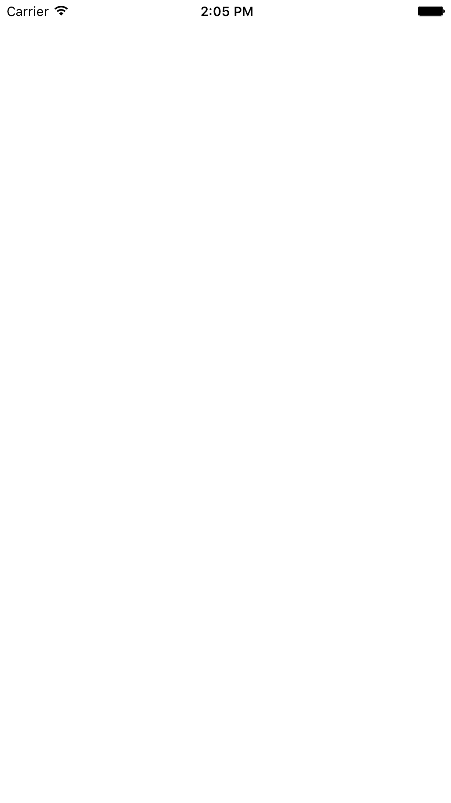

# IBM Cloud App ID
Swift Sample App Template for the IBM Cloud App ID service. The App ID Dashboard overwrites the following files with the user's information when they download an Swift sample app:
* appIDSample/Info.plist
* appIDSample/BMSCredentials.plist
* appIDSample/appIDSample.entitlements
* appIDSample/AppDelegate.swift

[![IBM Cloud powered][img-ibmcloud-powered]][url-ibmcloud]
[![Swift Badge][img-swift-badge]][url-swift-badge]
[![Travis][img-travis-master]][url-travis-master]
[![Coveralls][img-coveralls-master]][url-coveralls-master]
[![Codacy][img-codacy]][url-codacy]
[![License][img-license]][link-to-license]

[![GithubWatch][img-github-watchers]][url-github-watchers]
[![GithubStars][img-github-stars]][url-github-stars]
[![GithubForks][img-github-forks]][url-github-forks]

## Table of Contents
* [Requirements](#requirements)
* [Configuration](#configuration)
* [Run](#run)
* [Apache License](#apache-license)
* [IBM License](#ibm-license)

## Requirements

* iOS 10.0 or higher
* Xcode 9.0 or above
* Swift 4.0

## Configuration

### [IBM Cloud Mobile services Dependency Management](#bluemix-mobile-services-dependency-management)

This starter uses the IBM Cloud Mobile services SDKs to use the functionality of the Mobile Analytics and Push Notifications services.

The IBM Cloud Mobile services SDK uses [CocoaPods](https://cocoapods.org/) to manage and configure dependencies. To use our latest SDKs, you need version 1.1.0.rc.2.

You can install CocoaPods using the following command:

```bash
$ sudo gem install cocoapods --pre
```

If the CocoaPods repository is not configured, run the following command:

```bash
$ pod setup
```

For this starter, a pre-configured `Podfile` is included in the **ios_swift/Podfile** location. To download and install the required dependencies, run the following command in the **ios_swift** directory:

```bash
$ pod install
```
Open the Xcode workspace: `{APP_Name}.xcworkspace`. Continue to open the `.xcworkspace` file as it contains all the dependencies and configurations.

If you run into any issues during the pod install, it is recommended to run a pod update by using the following commands:

```bash
$ pod update
$ pod install
```

> [View configuration](#configuration)

## Run

Click **Product > Run** to start the app in Xcode.



The application has built in integration points for the Mobile Analytics and Push Notifications services.

## Apache License
This package contains code licensed under the Apache License, Version 2.0 (the "License"). You may obtain a copy of the License at http://www.apache.org/licenses/LICENSE-2.0 and may also view the License in the LICENSE file within this package.

## IBM License
Copyright (c) 2018 IBM Corporation

Permission is hereby granted, free of charge, to any person obtaining a copy of this software and associated documentation files (the "Software"), to deal in the Software without restriction, including without limitation the rights to use, copy, modify, merge, publish, distribute, sublicense, and/or sell copies of the Software, and to permit persons to whom the Software is furnished to do so, subject to the following conditions:

The above copyright notice and this permission notice shall be included in all copies or substantial portions of the Software.

THE SOFTWARE IS PROVIDED "AS IS", WITHOUT WARRANTY OF ANY KIND, EXPRESS OR IMPLIED, INCLUDING BUT NOT LIMITED TO THE WARRANTIES OF MERCHANTABILITY, FITNESS FOR A PARTICULAR PURPOSE AND NONINFRINGEMENT. IN NO EVENT SHALL THE AUTHORS OR COPYRIGHT HOLDERS BE LIABLE FOR ANY CLAIM, DAMAGES OR OTHER LIABILITY, WHETHER IN AN ACTION OF CONTRACT, TORT OR OTHERWISE, ARISING FROM, OUT OF OR IN CONNECTION WITH THE SOFTWARE OR THE USE OR OTHER DEALINGS IN THE SOFTWARE.

[img-ibmcloud-powered]: https://img.shields.io/badge/ibm%20cloud-powered-blue.svg
[url-ibmcloud]: https://www.ibm.com/cloud/

[img-swift-badge]: https://img.shields.io/badge/platform-ios_swift-lightgrey.svg?style=flat
[url-swift-badge]: https://developer.apple.com/swift

[img-travis-master]: https://travis-ci.org/ibm-cloud-security/app-id-sample-swift.svg?branch=master
[url-travis-master]: https://travis-ci.org/ibm-cloud-security/app-id-sample-swift?branch=master

[img-coveralls-master]: https://coveralls.io/repos/github/ibm-cloud-security/app-id-sample-swift/badge.svg
[url-coveralls-master]: https://coveralls.io/github/ibm-cloud-security/app-id-sample-swift

[img-codacy]: https://api.codacy.com/project/badge/Grade/5da7f95c0f2f4658ad14c282e8083dfe
[url-codacy]: https://www.codacy.com/app/ibm-cloud-security/app-id-sample-swift

[img-license]: https://img.shields.io/npm/l/ibmcloud-appid.svg
[link-to-license]: #apache-license

[img-github-watchers]: https://img.shields.io/github/watchers/ibm-cloud-security/app-id-sample-swift.svg?style=social&label=Watch
[url-github-watchers]: https://github.com/ibm-cloud-security/app-id-sample-swift/watchers
[img-github-stars]: https://img.shields.io/github/stars/ibm-cloud-security/app-id-sample-swift.svg?style=social&label=Star
[url-github-stars]: https://github.com/ibm-cloud-security/app-id-sample-swift/stargazers
[img-github-forks]: https://img.shields.io/github/forks/ibm-cloud-security/app-id-sample-swift.svg?style=social&label=Fork
[url-github-forks]: https://github.com/ibm-cloud-security/app-id-sample-swift/network
